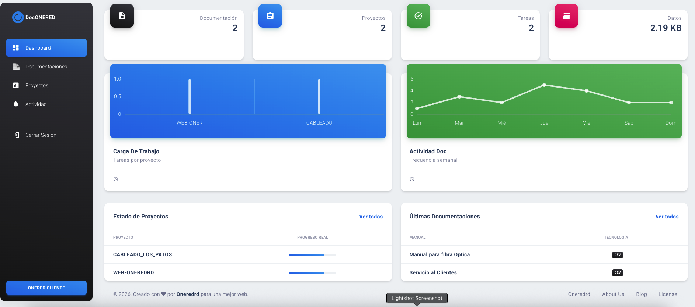

# 🚀 OneredRD - Dashboard de Gestión de Proyectos & Documentación

Bienvenido a **OneredRD**, una plataforma integral basada en React y Material UI diseñada para optimizar el flujo de trabajo, la gestión de tareas mediante tableros Kanban y la organización de documentación técnica.


---

## 🛠️ Funcionalidades Principales

### 📈 Dashboard Inteligente
* **Estadísticas en Tiempo Real:** Visualización de carga de trabajo, total de manuales y uso de almacenamiento local.
* **Gráficos de Frecuencia:** Monitoreo semanal de actividad en documentación.
* **Acceso Rápido:** Enlaces directos desde el Dashboard hacia proyectos y manuales específicos.

### 📋 Gestión de Proyectos (Kanban)
* **Progreso Ponderado:** El avance del proyecto no es solo un contador; se calcula según la etapa de la tarea:
  - `IDEAS💡` (15%) | `POR HACER🧾` (30%) | `EN PROCESO🔧` (55%) | `QA☑️` (75%) | `LISTO✅` (100%).
* **Persistencia Local:** Todos los tableros y tareas se guardan automáticamente en el navegador.

### 📚 Centro de Documentación
* **Biblioteca Técnica:** Organización de manuales por tecnología.
* **Badges Dinámicos:** Clasificación visual de documentos según el lenguaje o herramienta.

### 🎨 Personalización (Modo Pro)
* **Dark Mode Nativo:** Soporte completo para modo oscuro con persistencia tras recargar la página.
* **Sidenav Configurable:** Cambia colores y tipos de menú lateral al instante.

---


## 🚀 Instalación y Uso

Sigue estos pasos para ejecutar el proyecto localmente:

1. **Clona el repositorio:**
   ```bash
   git clone [https://github.com/tu-usuario/onered-dashboard.git](https://github.com/tu-usuario/onered-dashboard.git)

2. **Instala las dependencias:**

Bash

npm install
3. **Inicia el servidor de desarrollo:**

Bash

npm start
4. **Construye para producción**

Bash

npm run build

¡Claro que sí! Un buen README.md es fundamental para que cualquiera (o tú mismo en el futuro) entienda rápidamente de qué trata el proyecto y cómo ponerlo en marcha.

Aquí tienes una propuesta profesional y bien estructurada, diseñada específicamente para tu plataforma OneredRD:

Archivo: README.md
Markdown

🤝 Contacto y Redes
Desarrollado por OneredRD. Síguenos en nuestras plataformas:

Web: oneredrd.info

Instagram: @oneredrd

Facebook: Oneredrd